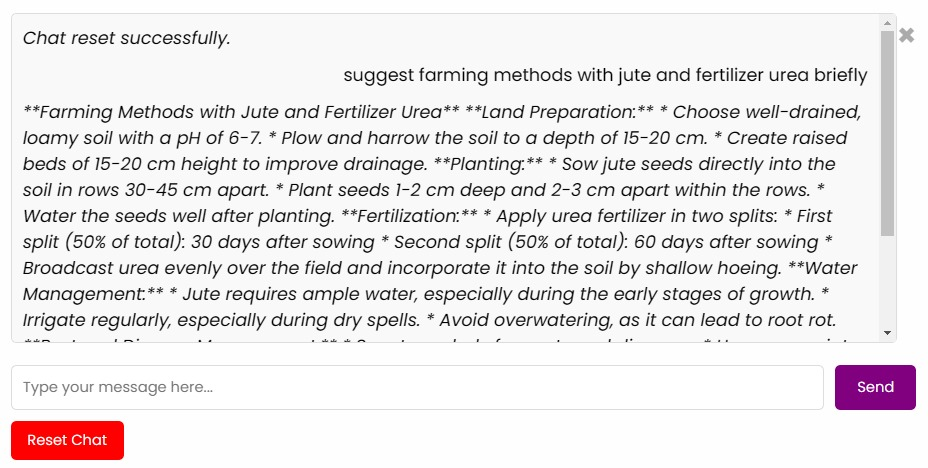

# Problem Statement

Agriculture faces significant challenges in optimizing crop yield and soil health, particularly with the growing need for sustainable and efficient farming practices. Farmers often lack access to precise, data-driven recommendations for selecting crops and fertilizers that align with environmental conditions, soil quality, and sustainability goals. Current solutions are either too generic or require expensive tools and expertise, making them inaccessible for small- and medium-scale farmers.

This gap results in suboptimal agricultural productivity, overuse of chemical fertilizers, degradation of soil quality, and increased environmental impact. To address these challenges, Earthworm provides an easy-to-use, intelligent system that delivers tailored recommendations for crop selection and fertilizer application based on key input constraints such as soil properties, weather conditions, and sustainability metrics.
# Problem Overview

 

Earthworm is an innovative platform designed to empower farmers by providing tailored crop and fertilizer recommendations based on their soil’s nutrient composition and environmental conditions. By integrating advanced data analytics and AI-driven algorithms, Earthworm analyzes soil values such as pH levels, macronutrients, and micronutrients, along with regional factors like rainfall and climate. The platform generates actionable insights to help farmers maximize yield, reduce costs, and ensure sustainable agricultural practices. Whether you’re managing a small farm or a large agricultural enterprise, Earthworm serves as a reliable partner in optimizing crop selection and fertilizer application for healthier soil and better productivity.
 

Earthworm AI, the platform’s interactive chatbot, serves as a virtual assistant to guide farmers in making informed decisions. Powered by Google's Gemini, it provides instant, user-friendly support by answering questions, analyzing soil values, and offering tailored advice on crop and fertilizer selection. Farmers can simply input their queries or soil data, and Earthworm AI delivers actionable insights, making the process seamless and accessible. Beyond recommendations, the chatbot helps educate users about sustainable practices and optimizes resource use, enhancing productivity and environmental care.
 

# Project Working

## Data

The data used to train the model was collected from the [Crop Prediction](https://www.kaggle.com/datasets/atharvaingle/crop-recommendation-dataset) dataset. The dataset consists of 2200 samples of 22 different crops whose predictions are made using 7 features: nitrogen, phosphorus, potassium, and pH content of the soil, temperature, humidity and rainfall. The dataset is perfectly balanced, with each crop having 100 samples.  The data was pre-processed to ensure consistency and cleaned to remove any missing values. The data includes information on various crop types, weather patterns, and soil types. 
 
The data used to train the model was collected from the [Fertiliser Prediction](https://www.kaggle.com/datasets/gdabhishek/fertilizer-prediction) dataset. The dataset consists of 100 entries of samples of 7 different fertilisers whose predictions are made using 6 features nitrogen, phosphorus, potassium, temperature, humidiyt and moisture%

## Model

The  models are built using Deep Neural Networks(DNNs). 
 
The architecture we have chosen for crop prediction consists of 3 hidden layers with 128, 64 and 128 neurons respectively, and an output layer of 22 neurons, each corresponding to one type of crop. The activation function in the input and hidden layers is SeLU, while the activation function for the output layer is softmax. 
 

 

The architecture chosen for fertiliser prediction consistes of two layers with 128 and 64 neurons respectively and an output layer of 7 neurons each corresponding to each fertiliser. The activation function used in hidden layers is SeLU and softmax in the output layer.
 

 
The model was created using Tensorflow and Keras.

## Training

The model was trained on the data with a 80:20 train-test split ratio. The objective function used was categorical crossentropy and the optimizer used was adam. Accuracy was used as the metric to evaluate the performance of the models. Training was done for 100 epochs on the crop prediction model and 50 epochs on fertiliser prediction model .

## Results

For crop prediction, our model got a 99% accuracy on train data and 97% accuracy on test data.
 

 

For fertiliser prediction our model got a 100% accuracy on both train and accuracy data.
 

 

## Chatbot

We have implemented a chatbot using Google's Gemini model

## Working

The following data is collected from the end-user to make predictions:
 
N, P, K, pH, temperature, humidity, moisture%, rainfall, location.
 
Further, we have created an interactive interface for users to enter relevant data to get predictions for their crop.
 

 

 

 

 

 

# Future Implementation

We envision several enhancements and features to further improve the functionality and usability of this project. Below are some ideas for future implementations:

1. **Enhanced Crop Recommendation System**
   - Incorporate real-time weather updates and seasonal trends for dynamic crop recommendations.
   - Use satellite imagery and remote sensing data for a more accurate assessment of soil and crop conditions.

2. **Improved Fertilizer Prediction**
   - Enable predictions based on organic fertilizers and sustainable farming practices.
   - Include cost-benefit analysis for recommended fertilizers to assist farmers in making cost-effective decisions.

3. **Mobile Application Integration**
   - Develop a mobile-friendly version of the platform for better accessibility in rural areas.
   - Implement offline capabilities to ensure usability in areas with limited internet connectivity.

4. **Multilingual Support**
   - Introduce tools to measure the environmental impact of farming decisions, such as carbon footprint and water usage.
  
5. **Sustainability Score**
   - Develop a mobile-friendly version of the platform for better accessibility in rural areas.
   - Implement offline capabilities to ensure usability in areas with limited internet connectivity.

# Tech Stack
Python using Tensorflow and Keras
 
flask
 
HTML CSS
 

# Installation 
Clone the repository
 
Create virtual environment: python -m venv venv
 
Activate virtual environment
 
venv/Script/activate
 
Install dependencies:
 
pip install requirements.txt
 

https://youtu.be/1NdMxQMTMa8

## Team Members

PowerRangers: Codeforce
 
Aman Backer
 
Johan Rajesh
 
Advaith Dinkar
 

A Vyshak

